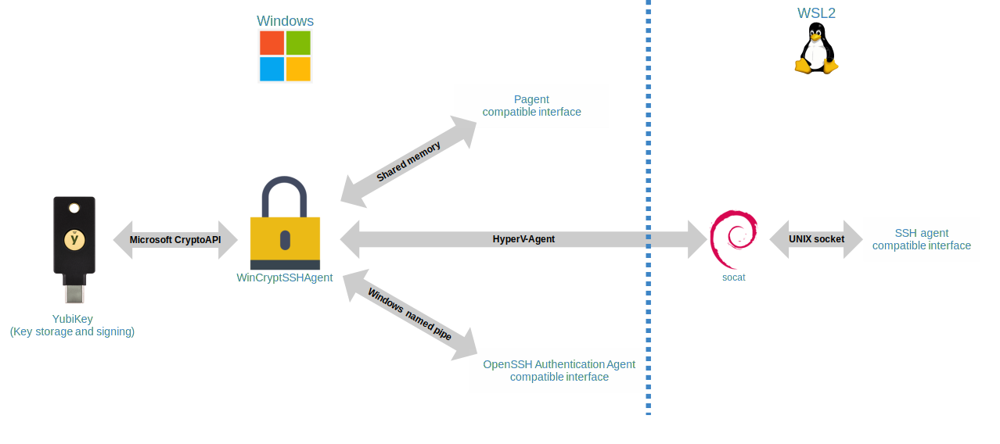

# WinCrypt SSH Agent


## Introduction

A SSH Agent based-on Windows CryptoAPI.

This project allows other programs to access SSH keys stored in your Windows Certificate Store for authentication.

Benefit by Windows Certificate Management, this project natively supports the use of windows user certificates or smart cards, e.g., Yubikey PIV, for authentication.

## Overview


## Feature

* Work with smart cards natively without installing any driver in Windows (PIV only)
* Support for OpenSSH certificates (so you can use your smart card with an additional OpenSSH certificate)
* Good compatibility

## Compatibility

There are many different OpenSSH agent implementations in Windows. This project implements five popular protocols in Windows:

* Cygwin UNIX Socket
* Windows UNIX Socket (Windows 10 1803 or later)
* Named pipe
* Pageant SSH Agent Protocol
* XShell Xagent Protocol

With the support of these protocols, this project is compatible with most SSH clients in Windows. For example:

* Git for Windows
* Windows Subsystem for Linux
* Windows OpenSSH
* Putty
* Jetbrains
* SecureCRT
* XShell
* Cygwin
* MINGW
* ...

## Installing

### Install with Chocolatey

```
choco install wincrypt-sshagent
```

### Manually Install

Stable versions can be obtained from the release page. 

Additionally, you may make an shortcut of this application to the startup folder.

## Usage

### Basic Usage

1. Start WinCryptSSHAgent
2. Right-click the icon on your taskbar
3. You can get necessary information by selecting your interesting item in the menu

Note: Some SSH clients using Pageant Protocol, e.g., Putty, XShell and Jetbrains, needn't any setting in system wide, thus you can't see Pageant in the menu.

Check [Yubikey with WSL tutorial](doc/wsl_tutorial.md) to start using Yubikey with SSH on WSL.

### Work with Xshell

1. Install and run WinCryptSSHAgent
2. Open the Properties dialog box of your session.
3. From Category, select 'SSH', Select 'Use Xagent (SSH agent)' for passphrase handling.
4. From Category, select 'Authentication' and select 'Public Key' as the authentication method.

### OpenSSH Certificates

OpenSSH supports authentication using SSH certificates. Certificates contain a public key, identity information and are signed with a standard SSH key.

Unlike TLS using X.509, OpenSSH uses a special certificate format, thus we can't convert your X.509 certificate into OpenSSH format.

To deal with OpenSSH Certificates, this project introduces a public key override mechanism.

If you want to work with OpenSSH certificates, you should put your OpenSSH Certificates in your `user profile` folder, rename them to `<Your Certificate Common Name>-cert.pub` or `<Your Certificate Serial Number>-cert.pub`.

### Debug log

1. Run `setx WCSA_DEBUG 1`
2. Reboot to take effect
3. Reproduce your problem
4. The debug log is located in `%USERPROFILE%\WCSA_DEBUG.log`

### Contribute

**Please use issues for everything**

- For a small change, just send a PR.
- For bigger changes open an issue for discussion before sending a PR.
- You can also contribute by:
  - Reporting issues
  - Suggesting new features or enhancements
  - Improve/fix documentation
